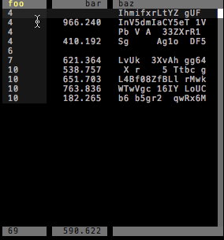

urwid-datatable
===============

A data table widget for urwid.

Features include:
* Flexible options for column formatting and sorting
* Progressive loading / "infinite scrolling" for paginating large datasets
*

TODOs:
* Make dependency on [sortedcontainers][1] optional
* Documentation

    [1]: https://github.com/grantjenks/sorted_containers

